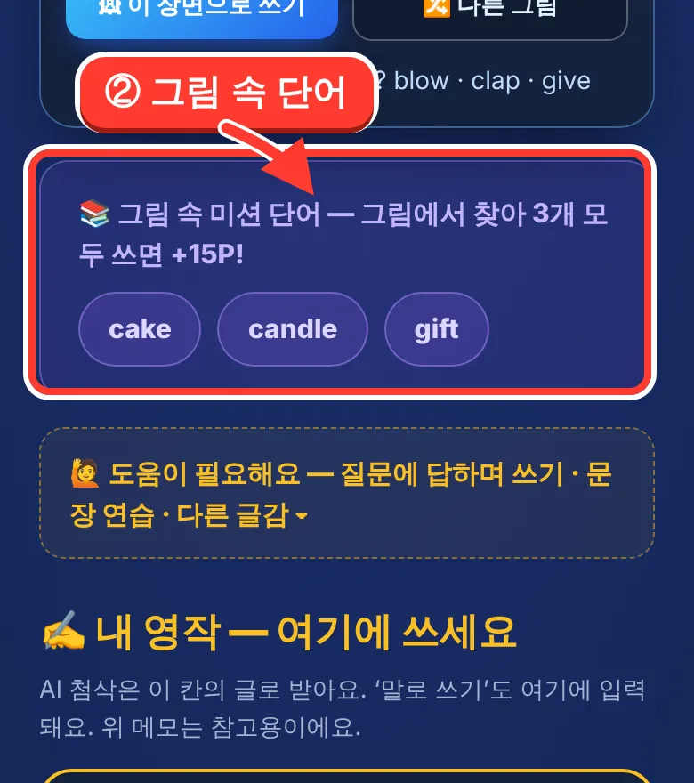
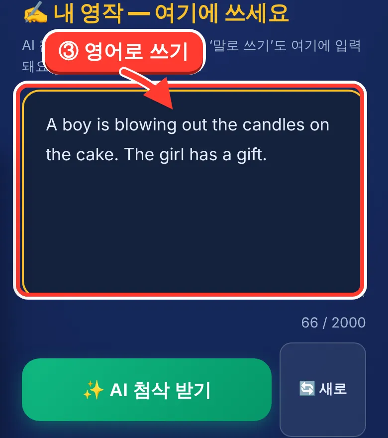
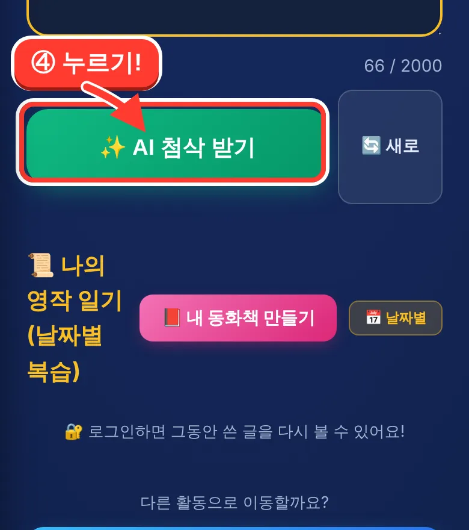
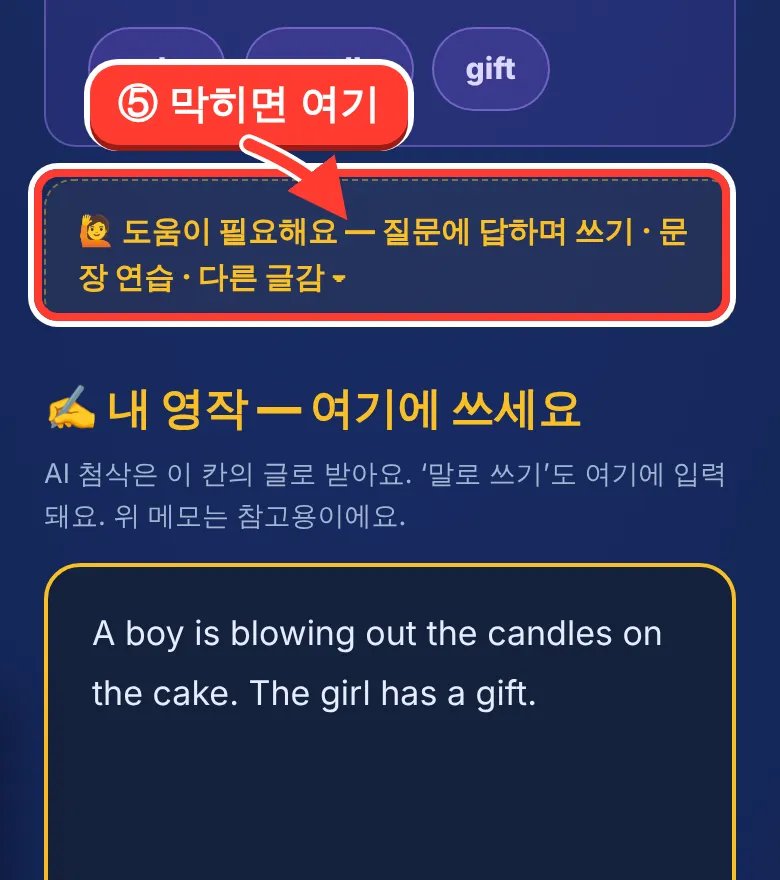

# ✍️ AI 영작 첨삭 — 사용 설명서 (초등학생용)

> 주소: **https://mangoi.ai/ai-write.html**
> 화면 맨 위의 **「📖 처음이에요? 사용 방법 보기」** 를 누르면 이 설명서가 화면 안에서 한 장씩 열립니다.
> 처음 들어온 학생에게는 한 번 저절로 열립니다(그 뒤로는 버튼으로 다시 봅니다).

선생님은 학생에게 이렇게 한마디만 하시면 됩니다.

> **"그림을 보고, 보라색 단어 3개를 넣어서 영어로 써 봐!"**

---

## ① 그림을 봐요

마음에 드는 그림을 골라요. 다른 그림이 보고 싶으면 **🔀 다른 그림** 을 눌러요.

## ② 그림 속 단어를 찾아요

보라색 단어 3개가 **그림 안에 숨어 있어요.** 3개를 모두 넣어서 쓰면 ⭐ **+15P!**
(단어는 그림마다 달라요. 생일 그림이면 `cake · candle · gift`. `candles` 처럼 여러 개로 써도 돼요.)

## ③ 영어로 써요

그림 속 사람이 무엇을 하는지 영어로 써요. 짧아도 괜찮아요!
**🎤 말로 쓰기** 버튼이 보이면 말로도 쓸 수 있어요.

## ④ 「AI 첨삭 받기」를 눌러요

망고 선생님이 틀린 곳을 고쳐 주고 점수를 알려 줘요. 고친 문장을 보고 따라 써 보면 포인트를 더 받아요.

## ⑤ 막히면 「🙋 도움이 필요해요」

무엇을 쓸지 모르겠으면 눌러 봐요. 질문에 답하면 문장 뼈대를 만들어 줘요.
(문장 연습 · 다른 글감 고르기도 이 안에 있어요.)

---

## 선생님께 — 무엇이 바뀌었나 (2026-10-08)

| 전 | 지금 | 이유 |
|---|---|---|
| 미션 단어가 그림과 따로 뽑혀 그림에 없는 `apple` 이 나옴 | 그 **그림에 실제로 보이는** 낱말 3개 (그림 36장 모두) | 선생님 피드백 «그림에 apple 이 없는데?» |
| 글쓰기 칸 위에 도구가 7겹 | 첫 화면은 **그림 → 미션 단어 → 글쓰기 → 제출** 만. 나머지는 «도움이 필요해요» 안에 접어 둠 | «화면이 복잡해 설명하기 어렵다» |
| 사용 방법 안내 없음 | 📖 사진+화살표 설명서 5장 | 사장님 지시 |
| `candles` 로 쓰면 미션 단어 `candle` 을 안 쓴 것으로 셈 | 복수형도 인정 | 아이들은 복수형으로 많이 씀 |

기능은 하나도 지우지 않았습니다(브레인스토밍·문장 연습·다른 글감·동화책·한 장 출력 그대로).
